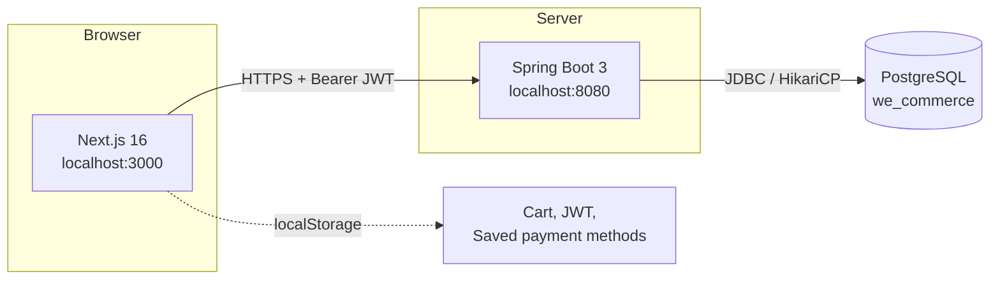
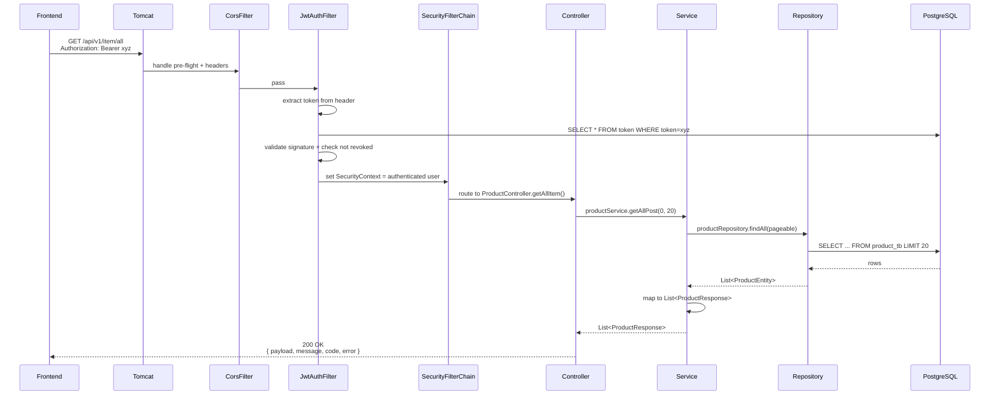
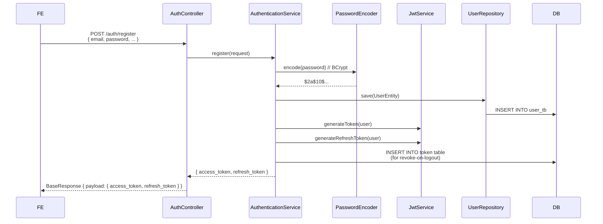
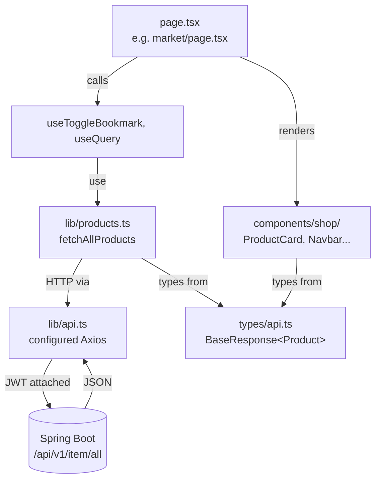
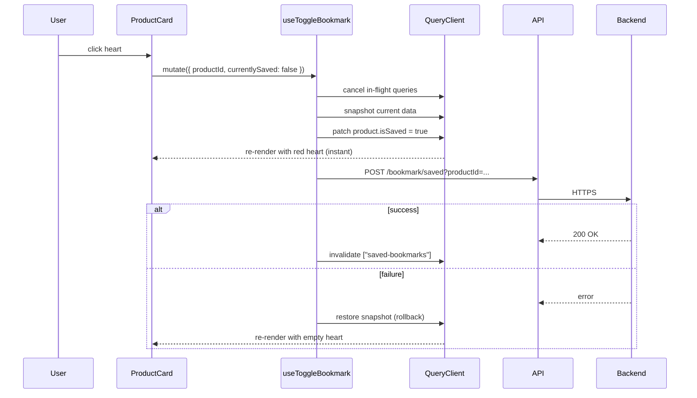
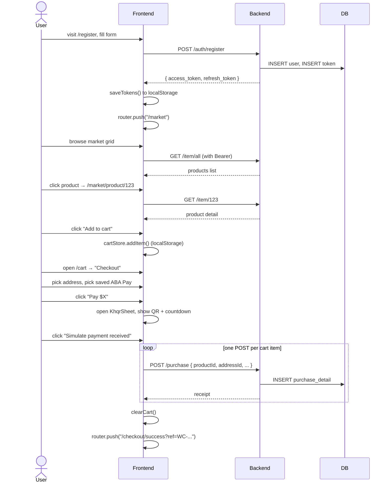
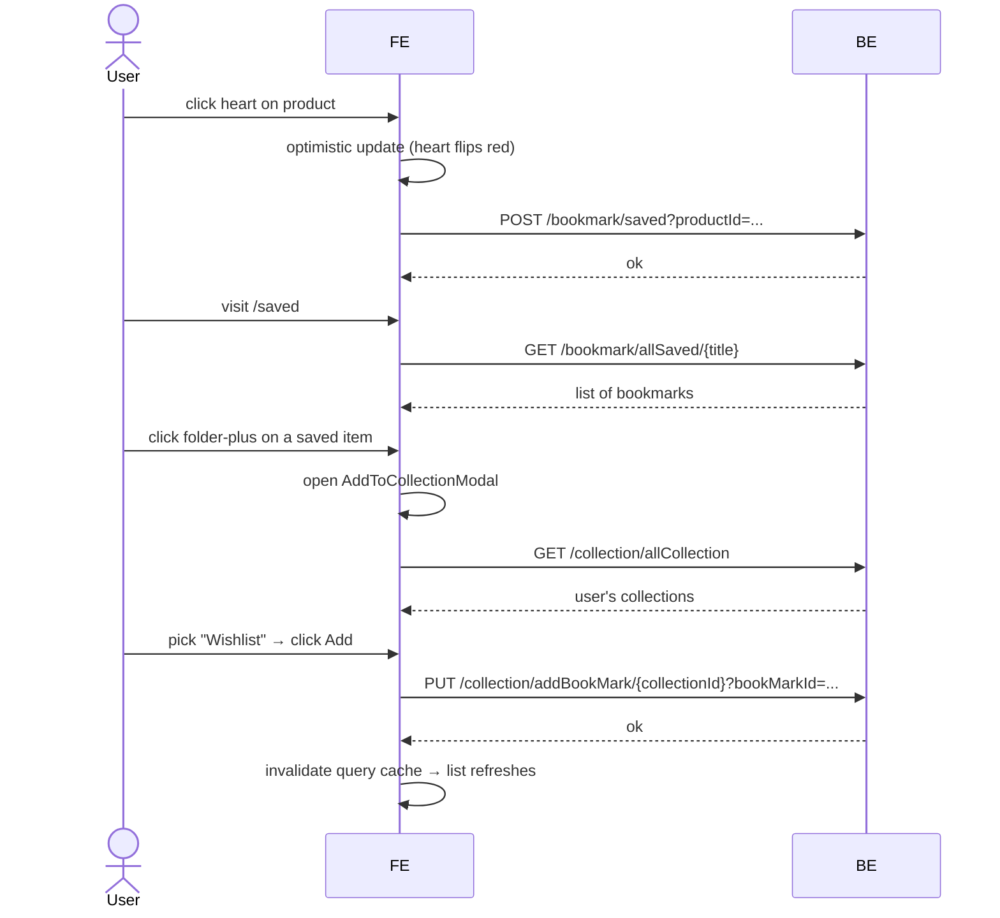

# We Commerce — Project Guide

> A multi-vendor marketplace web app. Backend in **Spring Boot 3 / Java 21 / PostgreSQL** with JWT auth. Frontend in **Next.js 16 / TypeScript / Tailwind v4**.
>
> This guide is the single source of truth for how the project works — API design, request lifecycles, frontend architecture, and end-to-end flows. Written so a new developer can pick it up in one sitting.

---

## Table of contents

1. [Overview & architecture](#1-overview--architecture)
2. [Repository layout](#2-repository-layout)
3. [Backend API design](#3-backend-api-design)
4. [Backend request workflow](#4-backend-request-workflow)
5. [Frontend architecture](#5-frontend-architecture)
6. [Frontend data flow & state](#6-frontend-data-flow--state)
7. [End-to-end flows (use cases)](#7-end-to-end-flows-use-cases)
8. [Mock data fallback](#8-mock-data-fallback)
9. [Local development setup](#9-local-development-setup)
10. [Known limitations & roadmap](#10-known-limitations--roadmap)

---

## 1. Overview & architecture

### What it is

A multi-vendor e-commerce marketplace: every signed-in user can both **buy** products from other users and **sell** their own. Features include browsing, bookmarks, collections, cart, checkout (with simulated ABA Pay / KHQR / Card payments), order history with status timeline, and profile management.

### High-level architecture



### Tech stack at a glance

| Layer | Backend | Frontend |
|---|---|---|
| **Language** | Java 21 | TypeScript (strict) |
| **Framework** | Spring Boot 3.4 | Next.js 16 (App Router) |
| **Auth** | Spring Security + JWT (jjwt) | Axios interceptor stores Bearer token |
| **Persistence** | Spring Data JPA + Hibernate | TanStack Query (server state) |
| **Client state** | — | Zustand + persist (cart, payment methods) |
| **Forms** | Bean Validation (planned) | React Hook Form + Zod |
| **Build** | Gradle | Turbopack |
| **Database** | PostgreSQL 16 | localStorage (cart, JWT) |

### Why these choices

- **Spring Boot** — Heang's daily Java stack; well-suited to layered REST APIs
- **Next.js App Router** — Server Components + streaming + file-based routing match the multi-page marketplace shape
- **TanStack Query** — single source of truth for server state with caching, retries, optimistic updates
- **Zustand** — 5 KB store for cart that survives page reloads via the `persist` middleware
- **JWT (stateless) + DB token tracking** — gets the best of both worlds: scalable verification + ability to revoke on logout

---

## 2. Repository layout

### Backend (`we-commerce-api`)

```
src/main/java/com/example/wecommerce_api/
├── WeCommerceApiApplication.java   ← Spring Boot entrypoint
├── config/
│   ├── SecurityConfiguration.java  ← Spring Security filter chain
│   ├── JwtAuthenticationFilter.java← runs on every request
│   ├── JwtService.java             ← sign / verify tokens
│   ├── CorsFilterConfiguration.java
│   └── AppConfig.java
├── controller/                     ← 11 REST controllers
│   ├── AuthController.java         ← /api/v1/auth/**  (public)
│   ├── ProductController.java      ← /api/v1/item/**
│   ├── CategoryController.java
│   ├── BookmarkController.java
│   ├── CollectionController.java
│   ├── AddressController.java
│   ├── PurchaseController.java
│   ├── UserController.java
│   ├── NotificationController.java
│   ├── FileController.java
│   └── ProductViewCountController.java
├── service/                        ← business logic per domain
├── repository/                     ← Spring Data JPA interfaces
├── entity/                         ← 18 @Entity classes
├── payload/                        ← request/response DTOs
└── enums/                          ← Role, TokenType, ResponseMessage
src/main/resources/
└── application.yml                 ← reads from env vars (no secrets in git)
```

### Frontend (`we-commerce-frontend`)

```
src/
├── app/                            ← App Router file-based pages
│   ├── layout.tsx                  ← root layout, wraps QueryProvider + Toaster
│   ├── page.tsx                    ← landing
│   ├── (auth)/                     ← route group, shared gradient layout
│   │   ├── login/page.tsx
│   │   └── register/page.tsx
│   └── (shop)/                     ← route group, auth-guarded
│       ├── layout.tsx              ← Navbar + BottomNav
│       ├── market/page.tsx
│       ├── market/product/[id]/page.tsx
│       ├── saved/page.tsx
│       ├── collections/page.tsx
│       ├── collections/[id]/page.tsx
│       ├── cart/page.tsx
│       ├── checkout/page.tsx
│       ├── checkout/success/page.tsx
│       ├── orders/page.tsx
│       ├── orders/[id]/page.tsx
│       └── profile/page.tsx
├── components/
│   ├── brand/Logo.tsx
│   └── shop/                       ← all marketplace UI
│       ├── Navbar.tsx
│       ├── BottomNav.tsx
│       ├── ProductCard.tsx
│       ├── CategoryStrip.tsx
│       ├── PaymentMethodPicker.tsx
│       ├── SavedPaymentMethodsList.tsx
│       ├── AddPaymentMethodModal.tsx
│       ├── KhqrSheet.tsx           ← ABA Pay / KHQR payment sheet
│       ├── CardPaymentSheet.tsx
│       ├── NewCollectionModal.tsx
│       ├── AddToCollectionModal.tsx
│       ├── OrderStatusBadge.tsx
│       ├── OrderTimeline.tsx
│       ├── ConfirmDialog.tsx
│       ├── AddToCartButton.tsx
│       └── CartNavLink.tsx
├── lib/                            ← fetcher functions per backend domain
│   ├── api.ts                      ← Axios client + JWT interceptor
│   ├── auth.ts                     ← token storage helpers
│   ├── image.ts                    ← photo URL resolver
│   ├── products.ts
│   ├── bookmarks.ts
│   ├── collections.ts
│   ├── addresses.ts
│   ├── purchase.ts
│   ├── user.ts
│   ├── orders.ts
│   ├── payment.ts
│   └── mockData.ts                 ← seed for empty-DB demos
├── hooks/
│   └── useToggleBookmark.ts        ← optimistic save/unsave mutation
├── store/                          ← Zustand stores
│   ├── cartStore.ts                ← cart items, persisted
│   └── paymentMethodsStore.ts      ← saved payment methods, persisted
├── providers/
│   └── QueryProvider.tsx           ← TanStack Query client
└── types/api.ts                    ← TypeScript mirrors of backend DTOs
```

---

## 3. Backend API design

### Base URL

```
http://localhost:8080/api/v1
```

### Response envelope (every endpoint)

```jsonc
{
  "payload": { ... } | [ ... ] | null,   // the actual data
  "message": "OK" | "UNAUTHORIZED" | ...,
  "code":    200 | "401",                // sometimes number, sometimes string
  "error":   false,
  "date":    "2026-05-15T10:30:00"       // optional
}
```

There are two slightly different wrapper classes (`BaseResponse` for auth, `ApiResponse` for other domains) but the frontend models them as a single generic `BaseResponse<T>` since the meaningful fields are the same.

### Authentication

| Endpoint | Method | Auth | Notes |
|---|---|---|---|
| `/auth/register` | POST | public | 9-field RegisterRequest, returns access + refresh token |
| `/auth/loginPhoneNumber/{phoneNumber}` | POST | public | ⚠️ phone in URL, no password check |
| `/auth/refresh-token` | POST | refresh token in header | returns new access token |

**Bearer token format**: All protected routes require an `Authorization: Bearer <jwt>` header. The frontend's Axios interceptor attaches it automatically.

### Endpoint groups

#### Products (`/item`)

| Method | Path | Description |
|---|---|---|
| GET | `/item/all?pageNumber=&pageSize=` | paginated list |
| GET | `/item/{id}` | single product |
| GET | `/item/popular` | top items |
| GET | `/item/title/{title}?pageNumer=&pageSize=` | search by title (note "pageNumer" typo) |
| GET | `/item/categoryName/{categoryName}?pageNumer=&pageSize=` | filter by category |
| POST | `/item/postProduct?categoryName=` | seller posts a product |
| GET | `/item/allItemByCurrenctUser` | products of current user |
| GET | `/item/allItemSelling` | seller's listings |
| GET | `/item/allItemPurchased` | products bought |
| GET | `/item/allItemSoldOut` | seller's sold items |
| PUT | `/item/hideProduct/{id}` | soft-hide |
| GET | `/item/totalItem` | counters |

#### Categories (`/category`)

| Method | Path | Description |
|---|---|---|
| GET | `/category/all` | list of all categories |

#### Bookmarks (`/bookmark`)

| Method | Path | Description |
|---|---|---|
| POST | `/bookmark/saved?productId=` | save a bookmark |
| DELETE | `/bookmark/unsaved?productId=` | unsave |
| GET | `/bookmark/allSaved/{title}` | list bookmarks by title |

#### Collections (`/collection`)

| Method | Path | Description |
|---|---|---|
| POST | `/collection/addCollection?collectionName=` | create |
| PUT | `/collection/addBookMark/{id}?bookMarkId=&bookMarkId=` | add bookmarks |
| PUT | `/collection/{id}?newCollectionName=` | rename |
| DELETE | `/collection/{id}` | delete |
| GET | `/collection/allCollection` | list user's collections |
| GET | `/collection/{id}` | one collection |

#### Addresses (`/address`)

| Method | Path | Description |
|---|---|---|
| POST | `/address/addAddressDelivery` | new |
| GET | `/address/listAddressDelivery` | list |
| PUT | `/address/editAddressDelivery/{id}` | edit |
| GET | `/address/{id}` | one address |

#### Purchases (`/purchase`)

| Method | Path | Description |
|---|---|---|
| POST | `/purchase` | place one purchase (one product per call!) |
| GET | `/purchase/receipt/{id}` | receipt by id |
| PUT | `/purchase/status/{productId}` | mark product status updated |

#### Users (`/user`)

| Method | Path | Description |
|---|---|---|
| GET | `/user/userprofile` | current user info |
| PUT | `/user/edit` | edit own profile |
| DELETE | `/user` | delete own account |
| GET | `/user/userByEmail/{email}` | lookup |

### What's protected vs public

```
public:
  /api/v1/auth/**
  /api/v1/fileView/**          (file downloads)
  Swagger UI + OpenAPI JSON

USER role required:
  /api/v1/user, /purchase, /countView, /item,
  /notification, /collection, /category, /bookmark, /address
```

Anything else → `403 Forbidden`.

---

## 4. Backend request workflow

### Request lifecycle (the diagram to memorize)



### Three-layer pattern

| Layer | Job | Example file |
|---|---|---|
| **Controller** | HTTP in, HTTP out. No business logic. | `ProductController.java` |
| **Service** | Business rules, transactions, mapping entity ↔ DTO | `ProductServiceImp.java` |
| **Repository** | Spring Data JPA, DB queries | `ProductRepository.java` |
| **Entity** | JPA-mapped tables | `ProductEntity.java` |
| **Payload** | Request / response DTOs | `ProductResponse.java` |

### Auth flow in detail (register example)



**Key idea**: JWTs are stateless, but the backend ALSO stores issued tokens in DB. This lets logout invalidate a still-unexpired token by flipping `revoked=true`. Best-of-both pattern.

### JWT filter walkthrough (`JwtAuthenticationFilter.java`)

```
1. Read Authorization header
2. If header missing or doesn't start with "Bearer " → continue chain (anonymous)
3. Strip "Bearer " → get raw JWT
4. Extract username (email) from JWT claims
5. Load UserDetails from DB via userDetailsService
6. Check DB: is this token still valid (not expired, not revoked)?
7. Validate JWT signature
8. If all checks pass → set SecurityContext.authentication = user
9. Continue chain — controller sees authenticated principal
```

---

## 5. Frontend architecture

### Routes (12 total)

| Route | What it shows | Auth required |
|---|---|---|
| `/` | Landing page (redirects to /market if logged in) | no |
| `/login` | Phone-number login form | no |
| `/register` | Registration form | no |
| `/market` | Product grid, categories, popular strip, search | yes |
| `/market/product/[id]` | Product detail with Buy / Add to cart / Save | yes |
| `/saved` | Bookmarked products (with collection picker) | yes |
| `/collections` | Collection cards with create-new modal | yes |
| `/collections/[id]` | Collection detail | yes |
| `/cart` | Cart items + summary + checkout CTA | yes |
| `/checkout` | Address picker, payment picker, place order | yes |
| `/checkout/success` | Order confirmation | yes |
| `/orders` | Order history with status filter tabs | yes |
| `/orders/[id]` | Order detail with timeline + actions | yes |
| `/profile` | Account, addresses, payment methods, sell-flow, danger zone | yes |

### Route groups

Next.js App Router lets you wrap pages in parentheses to share layouts without affecting URLs.

- **`(auth)`** — gradient background, centered card. Children: `/login`, `/register`.
- **`(shop)`** — top Navbar + BottomNav + auth guard. Children: everything else after login.

```
/login              → comes from (auth)/login/page.tsx, URL stays /login
/market             → comes from (shop)/market/page.tsx, URL stays /market
```

### Component layering



---

## 6. Frontend data flow & state

### Two kinds of state — keep them separate

| Kind | Lives in | Examples | Why |
|---|---|---|---|
| **Server state** | TanStack Query cache | products, categories, orders, bookmarks, profile, addresses | Needs caching, refetching, retries, optimistic updates |
| **Client state** | Zustand (or component state) | cart items, saved payment methods, modal open, current filter | No network involved; sometimes persists across refresh |

### Server state — TanStack Query pattern

Every page that reads data follows the same shape:

```tsx
const { data, isLoading, isError } = useQuery({
  queryKey: ["products", { search, category }],   // stable cache key
  queryFn: () => fetchAllProducts(0, 20),         // pure async function
});
```

Wrapped once in `app/layout.tsx` via `<QueryProvider>` (5-minute defaults).

### Optimistic update example (`useToggleBookmark.ts`)

When you tap a heart, the icon fills **before** the server confirms:



### Client state — Zustand with persist

**Cart** (`cartStore.ts`) and **saved payment methods** (`paymentMethodsStore.ts`) use the same pattern:

```ts
const useCartStore = create<CartState>()(
  persist(
    (set, get) => ({ items: [], addItem: ..., removeItem: ... }),
    { name: "ec-cart" }  // localStorage key
  )
);
```

Both survive page refresh, browser close, even cross-tab (Zustand auto-syncs).

### SSR-safe hydration

`localStorage` doesn't exist on the server. Pages that read it use a `mounted` guard:

```tsx
const [mounted, setMounted] = useState(false);
useEffect(() => setMounted(true), []);
if (!mounted) return <CartSkeleton />;
```

Without this you'd see a hydration warning and a flash of "empty cart".

### Axios interceptors (`lib/api.ts`)

```ts
api.interceptors.request.use(config => {
  const token = getAccessToken();
  if (token) config.headers.Authorization = `Bearer ${token}`;
  return config;
});

api.interceptors.response.use(
  res => res,
  err => {
    if (err.response?.status === 401) clearTokens();
    return Promise.reject(err);
  }
);
```

- **Request side** — attaches JWT to every outgoing call
- **Response side** — wipes tokens on 401 so subsequent calls don't keep failing

---

## 7. End-to-end flows (use cases)

### A. New user signs up and buys a product



### B. Save a product to a collection



### C. View order timeline

```mermaid
sequenceDiagram
    actor User
    participant FE
    participant BE

    User->>FE: visit /orders
    FE->>BE: GET /item/allItemPurchased
    BE-->>FE: purchased products

    Note over FE: transform into Order rows with mock status

    User->>FE: click an order → /orders/123
    FE->>FE: fetchOrderById(123)<br/>(currently mock; backend lacks endpoint)
    FE->>FE: render OrderTimeline<br/>(PLACED → CONFIRMED → SHIPPED → DELIVERED)
```

---

## 8. Mock data fallback

Every fetcher follows the same defensive pattern so the UI is **always demoable**, even on a fresh-cloned, empty database:

```ts
export async function fetchAllProducts(): Promise<PagedItems<Product>> {
  try {
    const res = await api.get("/item/all", { params: { pageNumber: 0, pageSize: 20 } });
    if (res.data.error) throw new Error(res.data.message);

    const paged = toPaged<Product>(res.data.payload);
    if (paged.content.length === 0 && !MOCK_DISABLED) {
      return { content: MOCK_PRODUCTS };   // empty DB → mock
    }
    return paged;
  } catch (err) {
    if (MOCK_DISABLED) throw err;
    console.warn("[products] /item/all failed — using mock data", err);
    return { content: MOCK_PRODUCTS };     // API down / 401 → mock
  }
}
```

**Three outcomes**:

| Backend state | Result |
|---|---|
| Has real data | Real products from DB |
| Running but empty DB | 12 mock products with stable Picsum images |
| Down or 401 | Mock products + console warning |

**Opt out** by setting `NEXT_PUBLIC_DISABLE_MOCK=true` in `.env.local`. The same pattern applies to categories, bookmarks, collections, orders, addresses, user profile, and saved payment methods.

---

## 9. Local development setup

### Prerequisites

- **PostgreSQL 16** running on localhost:5432
- **Node 22 LTS** (or Node 20+)
- **Java 21** (Eclipse Temurin / Adoptium)
- **IntelliJ IDEA** (for backend) and any IDE for frontend

### 1. Database

```powershell
psql -U postgres -c "CREATE DATABASE we_commerce;"
```

### 2. Backend

```powershell
cd C:\Practice\we-commerce-api\we-commerce-api-main
```

Either:
- **IntelliJ**: open the project, the `.run/WeCommerceApiApplication.run.xml` config sets env vars for you. Click ▶.
- **Terminal**:
  ```powershell
  $env:DB_PASSWORD="123"
  $env:JWT_SECRET_KEY="404E635266556A586E3272357538782F413F4428472B4B6250645367566B5970"
  .\gradlew.bat bootRun
  ```

Wait for: `Tomcat started on port 8080`. Then check Swagger UI at `http://localhost:8080/swagger-ui.html`.

### 3. Frontend

```powershell
cd C:\Practice\we-commerce-api\we-commerce-frontend
npm install         # first time only
npm run dev
```

Open `http://localhost:3000`. The frontend already has `.env.local` pointing to `http://localhost:8080/api/v1`.

### Env vars summary

#### Backend (`.env` in repo root, gitignored)
```
DB_URL=jdbc:postgresql://localhost:5432/we_commerce
DB_USERNAME=postgres
DB_PASSWORD=123
JWT_SECRET_KEY=<64-char hex>
JWT_EXPIRATION=3153600000000
JWT_REFRESH_EXPIRATION=31536000000000
```

#### Frontend (`.env.local`, gitignored)
```
NEXT_PUBLIC_API_URL=http://localhost:8080/api/v1
NEXT_PUBLIC_DISABLE_MOCK=false   # optional
```

---

## 10. Known limitations & roadmap

### Backend gaps (would refactor in production)

- ⚠️ Login uses phone-only with no password verification — must require password or OTP
- ⚠️ Auth failure returns HTTP 500 with `code: "401"` in body — should return HTTP 401 directly
- ⚠️ JWT expiration is ~100 years — should be 15 min for access, 7 days for refresh
- ⚠️ Missing `@Valid` on `@RequestBody` for input validation
- ⚠️ No pagination on some list endpoints; some param names have typos (`pageNumer`, `refernce`)
- ⚠️ `/purchase` accepts one product per request — frontend parallelizes via `Promise.all`
- No `OrderStatus` enum on purchases; status timeline is frontend-mocked
- No reviews / ratings entities
- No saved-payment-method persistence backend-side (frontend uses localStorage)

### Frontend nice-to-haves

- Real ABA PayWay integration (requires Cambodian merchant account; the UI is shaped for it)
- Stripe Sandbox for card payments (one-day swap)
- Unit / integration tests
- Server-side auth middleware in addition to the client-side guard
- A real `qrcode.react` for the KHQR sheet instead of the SVG mock

### Suggested next steps

1. **Deploy** — Vercel (frontend) + Railway (backend) → live demo URL
2. **README polish** — screenshots, badges, link to this guide
3. **Backend additions** — `OrderStatus`, `ReviewEntity`, `GET /myOrders`, `GET /purchase/{id}` (~3–4 hr of Java)
4. **Real payment integration** — ABA PayWay sandbox or Stripe sandbox

---

## Quick reference card

```
# start everything
psql -U postgres -c "CREATE DATABASE we_commerce;"
./gradlew bootRun          # backend → :8080
npm run dev                # frontend → :3000

# response envelope (every endpoint)
{ payload, message, code, error, date? }

# auth header on every protected call
Authorization: Bearer <jwt>

# state-management rule of thumb
server data → TanStack Query
local-only → Zustand (cart, payment methods) or useState

# mock fallback opt-out
NEXT_PUBLIC_DISABLE_MOCK=true
```

---

### Authors & credits

Built by **Hen Heang** as a portfolio project. Backend extends a starter Spring Boot REST API; frontend designed and built end-to-end during this sprint.

- GitHub: https://github.com/Hen-Heang
- LinkedIn: https://www.linkedin.com/in/hen-heang
